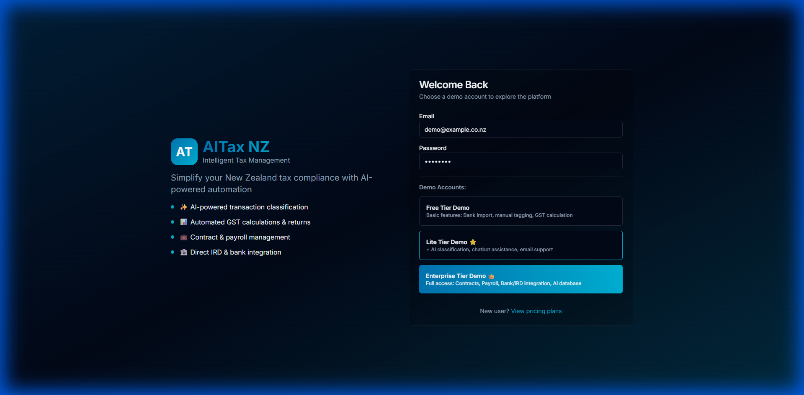
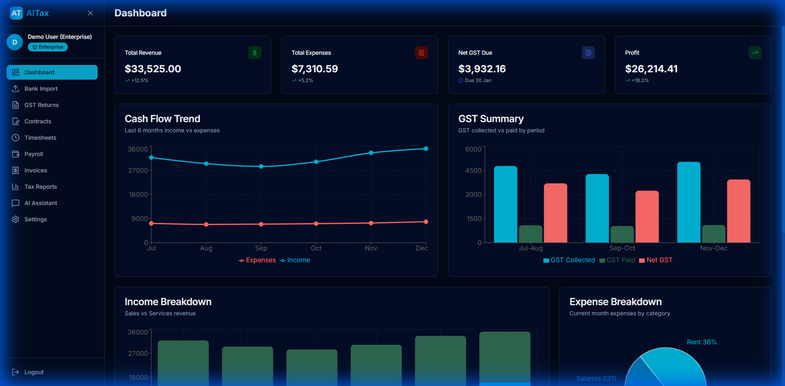

# AITax NZ - AI-Powered Tax Management System for New Zealand

**Make Tax Management Smarter, Simpler, and Compliant**

---

## 📋 Project Overview

AITax NZ is a comprehensive AI-powered tax management platform designed specifically for New Zealand businesses. We seamlessly integrate artificial intelligence technology with New Zealand tax compliance requirements to provide enterprises with an all-in-one solution from bank statement management to IRD filing.

### 🎯 Core Value Proposition

- **Save Time**: AI auto-categorizes transactions, reducing 90% of manual data entry
- **Improve Accuracy**: Smart GST calculations prevent filing errors
- **Ensure Compliance**: Fully compliant with IRD (Inland Revenue Department) requirements
- **Reduce Costs**: Save over 60% compared to traditional accounting services
- **Real-time Insights**: Visualize financial data to support business decisions

---

## 🌟 System Interface Showcase

### Professional Modern UI Design

*Modern login interface with New Zealand-themed colors (teal-blue gradient), supporting quick access to all three tiers*

### Intelligent Financial Dashboard

*Real-time financial overview with visualized analysis of revenue, expenses, GST, and profit. Interactive charts help you quickly understand your financial health*

---

## 💼 Core Features

### 1️⃣ Smart Bank Statement Management

- ✅ **One-Click Import**: Support for ANZ bank CSV format (expanding to ASB, BNZ, etc.)
- 🤖 **AI Auto-Classification**: 92-98% accuracy in automatic transaction categorization
- 📊 **Intelligent Tagging**: Distinguish income/expense, auto-calculate GST
- 🔍 **Manual Review**: All AI suggestions can be manually verified and adjusted

**Use Cases**:
- Businesses processing large volumes of monthly bank transactions
- Accurate categorization for accounting records
- Multi-account management requirements

---

### 2️⃣ Automated GST Calculation & Filing

- 🧮 **Auto-Calculate**: Automatic 15% GST calculation on income and expenses
- 📈 **Visual Reports**: Intuitively display GST collected vs. deducted
- ⚖️ **Net Calculation**: Automatically calculates tax payable or refund amount
- 📅 **Historical Records**: Complete GST filing history tracking
- 📄 **One-Click Export**: Generate IRD-required report formats

**Value**:
- Avoid penalties from calculation errors
- Save accountant time
- Meet GST filing deadlines

---

### 3️⃣ AI Contract Generation (Enterprise)

- 📝 **Smart Generation**: AI automatically generates NZ-compliant contracts
- 👔 **Employment Contracts**: Including Kiwisaver, annual leave, and statutory clauses
- 🏠 **Lease Agreements**: Commercial leases with CPI adjustment clauses
- ✍️ **Customizable**: Adjust terms based on specific needs
- 💾 **Centralized Management**: Unified storage and viewing of all contracts

**Target Users**:
- Businesses with employees
- Companies with commercial lease requirements
- Enterprises needing standardized contract management

---

### 4️⃣ Employee Time & Payroll Management (Enterprise)

**Timesheet System**
- ⏰ Weekly hours tracking
- 💵 Automatic wage calculations
- 📊 Employee performance tracking

**Payroll & Kiwisaver**
- 💰 Automatic PAYE (payroll tax) calculation
- 🏦 3% employee + 3% employer Kiwisaver
- 📋 Complete payroll details
- 📄 One-click payslip generation

**Value**:
- Ensure accurate wage calculations
- Automatically comply with IRD requirements
- Simplify payroll processes

---

### 5️⃣ Professional Invoice System

- 📄 **Professional Templates**: Compliant with NZ business standards
- 💰 **Auto GST Calculation**: 15% tax rate automatically included
- 📧 **Online Sending**: Send directly to clients
- 📊 **Status Tracking**: Paid, pending, overdue at a glance
- 💳 **Payment Management**: Track all accounts receivable

**Ideal For**:
- B2B service companies
- Consulting firms
- Businesses requiring formal invoicing

---

### 6️⃣ Annual Tax Reports

- 📊 **Profit & Loss Statement**: Complete income and expense analysis
- 📈 **Year-on-Year Comparison**: Year-over-year growth trend analysis
- 🎯 **Category Statistics**: Revenue and expense breakdowns
- 📄 **Export Reports**: Suitable for accountants and IRD
- 🔍 **Deep Insights**: Support business decision-making

---

### 7️⃣ AI Smart Assistant

**Tax Knowledge Q&A (Lite+)**
- 🤖 Answer New Zealand tax-related questions
- 📚 GST, PAYE, Kiwisaver rules inquiries
- ⏰ Filing deadline reminders
- 📖 Tax law explanations

**Database Intelligent Query (Enterprise)**
- 💬 Natural language financial data queries
- 📊 "What's the total revenue for the past 6 months?"
- 🔍 "Which expenses exceeded $5,000?"
- 📈 Instant data insights

---

## 💎 Three Tiers to Meet Different Needs

### 🆓 Free Tier - For Startups

**$0/month**

✅ ANZ bank statement import  
✅ Manual transaction categorization  
✅ GST calculation and reports  
✅ Tax reports (P&L)  
✅ Invoice generation  
✅ Basic email support  

**Best For**:
- Solo entrepreneurs just starting out
- Businesses with low transaction volumes
- Budget-conscious startups

---

### ⭐ Lite Tier - For Growing Businesses

**$49.99/month** (Recommended)

All Free features, plus:

✨ **AI Auto-Classification** (92-98% accuracy)  
🤖 **Tax Knowledge Chatbot**  
📧 **Priority Email Support**  
📬 **Email Notifications**  
📊 **Advanced GST Analytics**  

**Best For**:
- Medium-volume businesses (50+ transactions/month)
- Business owners looking to save time
- Accounting processes needing AI assistance

**ROI Calculation**:
- Save ~20 hours/month on manual categorization
- At $30/hour, saves $600
- **Return on Investment**: 1200%

---

### 👑 Enterprise Tier - For Established Businesses

**$149.99/month**

All Lite features, plus:

📝 **AI Contract Generation** (Employment + Lease)  
⏰ **Employee Timesheet Management**  
💰 **Auto Payroll + Kiwisaver Calculation**  
🏦 **Direct Bank Integration** (ANZ/ASB/BNZ)  
🏛️ **IRD API Auto-Filing**  
🤖 **AI Database Query System**  
☎️ **24/7 Phone Support**  
👤 **Dedicated Account Manager**  

**Best For**:
- Businesses with employees (5+ people)
- Companies needing full automation
- Enterprises wanting direct bank/IRD integration

**Value**:
- Save 80% compared to hiring a full-time accountant ($60k+/year)
- Fully automated compliance processes
- Reduce human error risks

---

## 🏆 Competitive Advantages

### vs. Traditional Accounting Services

| Feature | AITax NZ | Traditional Accountant |
|---------|----------|----------------------|
| **Cost** | $50-150/month | $3,000-8,000/year |
| **Response Time** | Instant | 1-3 days |
| **GST Calculation** | Automatic | Manual |
| **Data Entry** | AI Auto | Manual/Outsourced |
| **24/7 Available** | ✅ | ❌ |
| **Real-time Reports** | ✅ | ❌ |

### vs. Other Tax Software

| Feature | AITax NZ | Xero | MYOB |
|---------|----------|------|------|
| **AI Classification** | ✅ | ❌ | ❌ |
| **Chinese Support** | ✅ | Partial | Partial |
| **Contract Generation** | ✅ | ❌ | ❌ |
| **AI Assistant** | ✅ | ❌ | ❌ |
| **NZ Localization** | 100% | Global | Global |
| **Price** | $0-150 | $30-70 | $30-100 |

**Our Advantages**:
1. **Only AI-powered classification system for NZ tax**
2. **100% customized for the New Zealand market**
3. **Bilingual English/Chinese support**
4. **Smarter automation**

---

## 🔒 Security & Compliance

### Data Security

- 🔐 **Bank-Grade Encryption**: 256-bit AES encryption
- 🔒 **Secure Transmission**: HTTPS/TLS 1.3
- 💾 **Daily Backups**: Automatic cloud backups
- 👤 **Access Control**: Role-based access management
- 📱 **Two-Factor Authentication**: Protect account security

### New Zealand Compliance

- ✅ **IRD Certified Compliant**: Meets all tax authority requirements
- ✅ **Privacy Act 2020**: Compliant with privacy regulations
- ✅ **GST Act 1985**: Correct GST calculations
- ✅ **Employment Relations Act**: Compliant employment contracts
- ✅ **Data Stored in NZ**: Meets data sovereignty requirements

---

## 🚀 Technical Architecture

### Frontend Technology

- **Framework**: React 18 + TypeScript
- **Styling**: Tailwind CSS (professional design system)
- **Charts**: Recharts (interactive visualization)
- **Performance**: Vite build, fast loading

### Backend Technology (Planned)

- **Server**: Node.js / Python FastAPI
- **Database**: MySQL 8.0 (high performance)
- **AI Engine**: OpenAI GPT-4
- **Integration**: Bank APIs, IRD API

### Deployment

- **Cloud Platform**: AWS Sydney (NZ proximity)
- **CDN**: Global acceleration
- **Availability**: 99.9% SLA guarantee
- **Backup**: Daily automatic backups

---

## 📈 Implementation Roadmap

### Phase 1 - MVP (Current) ✅

- ✅ Complete frontend UI/UX
- ✅ All 10 core features
- ✅ Three-tier feature differentiation
- ✅ Complete mock data demo

### Phase 2 - Backend Development (2-3 months)

- 🔄 API server development
- 🔄 MySQL database setup
- 🔄 User authentication system
- 🔄 Payment integration (Stripe)

### Phase 3 - AI Integration (1-2 months)

- 🔜 OpenAI GPT integration
- 🔜 Transaction classification model training
- 🔜 Contract generation optimization
- 🔜 Intelligent Q&A system

### Phase 4 - Third-Party Integration (2-3 months)

- 🔜 ANZ Bank API integration
- 🔜 IRD API integration
- 🔜 ASB, BNZ bank expansion
- 🔜 Email notification system

### Phase 5 - Beta Testing (1 month)

- 🔜 Invite early customers
- 🔜 Collect feedback
- 🔜 Optimize and fix
- 🔜 Performance tuning

### Phase 6 - Official Launch (TBD)

- 🔜 Public release
- 🔜 Marketing campaigns
- 🔜 Customer support system
- 🔜 Continuous feature iteration

---

## 💰 Business Model

### Pricing Strategy

**Free Tier**: Attract new customers, build user base  
**Lite Tier**: Primary revenue source (target: 1,000+ users)  
**Enterprise Tier**: High-value customers (target: 100+ businesses)  

### Revenue Forecast (12 Months)

| Tier | Target Users | Monthly Fee | Annual Revenue |
|------|-------------|-------------|----------------|
| Free | 5,000 | $0 | $0 |
| Lite | 1,000 | $49.99 | $599,880 |
| Enterprise | 100 | $149.99 | $179,988 |
| **Total** | **6,100** | - | **$779,868** |

### Target Market

- 🎯 **NZ SMEs**: 195,000 businesses (Stats NZ)
- 🎯 **Chinese Businesses**: 30,000+ businesses
- 🎯 **Revenue $100k-$5M** businesses
- 🎯 **1-50 employees** size

### Market Penetration

- **Year 1**: 0.5% market share (~1,000 businesses)
- **Year 2**: 1.5% market share (~3,000 businesses)
- **Year 3**: 3% market share (~6,000 businesses)

---

## 🎯 Customer Case Studies (Projected)

### Case Study 1: Consulting Firm

**Problem**:
- 200+ monthly bank transactions requiring manual categorization
- GST calculation prone to errors
- High accountant fees ($5,000/year)

**Solution**:
- Use Lite tier AI auto-classification
- Automatic GST calculation and filing
- Real-time financial insights

**Results**:
- Save 20 hours/month of manual work
- Reduce 90% of accounting fees
- Zero GST filing errors

---

### Case Study 2: Retail Business

**Problem**:
- Complex payroll management for 10 employees
- Kiwisaver calculation errors
- Multiple systems needed for different operations

**Solution**:
- Upgrade to Enterprise tier
- Integrate timesheets, payroll, Kiwisaver
- Unified financial management

**Results**:
- Payroll processing time reduced from 2 days to 2 hours
- 100% accurate Kiwisaver calculations
- Overall cost reduction of 70%

---

## 📞 Contact Us

### Product Demo

We offer **free one-on-one product demonstrations**:
- 📅 30-minute online demo
- 💬 Understand your specific needs
- 🎁 Free 1-month Enterprise trial

### Contact Information

**Email**: contact@aitax.co.nz  
**Phone**: 0800 AITAX NZ  
**Website**: www.aitax.co.nz  
**Address**: Auckland, New Zealand  

### Social Media

**LinkedIn**: AITax NZ  
**WeChat**: AITax New Zealand  

---

## 🎁 Special Offers

### Early Customer Benefits

First 100 registered users receive:

1. **50% off first year** (Lite/Enterprise tiers)
2. **Free data migration** service
3. **Dedicated account manager** one-on-one training
4. **Priority feature requests**
5. **Lifetime VIP discount**

### Referral Program

Refer a new customer, both parties get **$50 credit**

---

## ❓ Frequently Asked Questions

**Q: Can I upgrade or downgrade my plan anytime?**  
A: Yes, you can switch between the 3 tiers anytime. Monthly billing with no lock-in period.

**Q: Where is data stored?**  
A: All data is stored on AWS servers within New Zealand, meeting data sovereignty requirements.

**Q: Which banks are supported?**  
A: Currently supports ANZ, with ASB, BNZ, Westpac, and Kiwibank coming soon.

**Q: How accurate is AI classification?**  
A: Our trained AI model achieves 92-98% accuracy, with all suggestions subject to manual review.

**Q: Do you provide invoices?**  
A: Yes, all subscription fees include GST-compliant formal invoices.

**Q: Can I export my data?**  
A: Yes, we support export in CSV, PDF, Excel, and other formats.

---

## 📄 Appendix

### System Requirements

- **Browser**: Chrome, Firefox, Safari, Edge (latest versions)
- **Network**: Stable internet connection
- **Device**: PC, Mac, Tablet

### Supported File Formats

- **Import**: CSV, Excel
- **Export**: PDF, CSV, Excel

### Language Support

- 🇬🇧 English
- 🇨🇳 Simplified Chinese

---

**Get Started**: Visit www.aitax.co.nz to register for a free account

**Call Now**: 0800 AITAX NZ

---

*This project has completed MVP development with a fully demonstrable frontend. Backend development launching soon. Investors and early customers welcome to discuss partnerships.*

**© 2026 AITax NZ. All rights reserved.**
